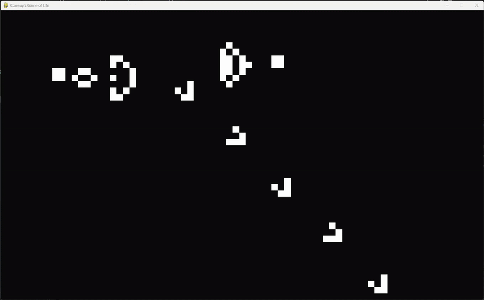

# Dev Log: Conway's Game of Life

<div align="center">
    
</div>

## The Theory
Conway's game of life is the equivalent of a LeBron James in computer science. Everyone knows about it and it it's bag is too deep. So I decided to make that my next project because why not! This is probably going to be a one-session project but always work a good dev log. Also going to try reference websites I find information on but we'll see how long I can be bothered with that.

The main theory behind this comes down to only 4 rules (found on Wikipedia[^1]) which make the universes and beings that come to be in these simulations (I've given each of them names for notation purposes):
1. **Underpopulation**: Any live cell with fewer than two live neighbours dies, as if by underpopulation.
2. **Harmony**: Any live cell with two or three live neighbours lives on to the next generation.
3. **Overpopulation**: Any live cell with more than three live neighbours dies, as if by overpopulation.
4. **Reproduction**: Any dead cell with exactly three live neighbours becomes a live cell, as if by reproduction.

Once these are implemented we can see a bunch of behaviours from starting configurations such as **gliders**, **still lifes** and **oscillators**.

## Log 1: Grid System
To start, we need to create the grid system on which the game will sit. Essentially, the environment needs to be split up into squares and hopefully each has an ID which allows for them to be retrieved immediately (instead of looping through every single square later down the line).

For example, when implementing the reproduction rule, we can just look at neighbours of the currently live cells as for a cell to become live it must be next to a live cell - this makes the program run a lot smoother as we aren't looping through hundreds of squares.

With a square size of 10x10 pixels, if we had a screen size of 1000x1000, we'd have 100 squares and therefore 100 IDs e.g. (392, 200) equates to "39_200" and (9, 12) equates to "0_1" in string format (made the id's legible). There could be a better way of doing this but for now this is what i've thought of.

First, I implemented a little bit of code to get the position of the mouse if the user clicks.

```python
for event in pygame.event.get():
    # ...
    elif event.type == pygame.MOUSEBUTTONDOWN:
        x, y = pygame.mouse.get_pos()
        print(x, y)
```

Now we can create our `Universe` class which will store the main simulation code - including the grid calculation code.

```python
class Universe():
    def __init__(self, cell_size:int, simulation_size:tuple):
        # Set of all cells (so we can't accidentally include duplicates)
        self.live_cells = set()

        # Size of the window in (width, height)
        self.simulation_size = simulation_size

        # Size of a single cell
        self.cell_size = cell_size
    
    def coords_to_id(self, coordinate: tuple) -> str:
        """Converts coordinates into a string id"""
        x, y = coordinate
        return f"{x // self.cell_size}_{y // self.cell_size}"

    def id_to_coords(self, id: str) -> tuple:
        """Converts an ID back into coordinates"""
        coords = (int(n) * self.cell_size for n in id.split("_"))
        return coords
```

To make sure it works i just set the screen size to 900 and made the cell size 300 so that we would get all combinations of ids from 0_0 to 2_2 to make sure it worked.

For the same of usability I wanted to now include a grid visual to show where the grid actually is. This seemed easy enough - all i'd need to do is draw a box in every cell the size of the cell.

```python
def draw_grid(self, screen) -> None:
    # Loop through all x and y coordinates for the grid
    for x in range(0, self.SIM_SIZE.width, self.cell_size):
        for y in range(0, self.SIM_SIZE.height, self.cell_size):
            # Draw a rect in all positions
            rect = pygame.Rect(x, y, self.cell_size, self.cell_size)
            pygame.draw.rect(screen, self.grid_colour, rect, 1)
    
    
def draw(self, screen) -> None:
    """Draws the updated universe"""
    self.draw_grid(screen)
```

That gives us this:

<div align="center">
    
    <p><em>Figure 1: Grid!</em></p>
</div>

With a more realistic grid size and a darker colour so the grid isn't so overpowering we get this something like this:

<div align="center">
    
    <p><em>Figure 2: Grid with smaller cells and less intense colour</em></p>
</div>

With this we now have both a grid and the ability to click and get a grid cell's id.

### Adding Cells to Grid
Now we have the grid we want to be able to add cells to the grid if the user clicks on a certain square. The flow for this that seems most logical is:
1. User clicks on grid
2. Universe converts this coordinate to an ID
3. If ID isn't in the set then add it, otherwise remove it
4. Loop through set of cells and draw each of them using the ID

Implemented like so:
```python
def handle_click(self, coords:tuple) -> None:
    """Handle a user clicking on the grid"""

    # Convert coordinate to ID
    id = self.coords_to_id(coords)

    # Check if we already had this cell in
    if id in self.live_cells: self.live_cells.remove(id)
    else: self.live_cells.add(id)
    
def draw_cells(self, screen) -> None:
    """Draw currently live cells to the screen"""

    # Loop through all cell ids
    for cell in self.live_cells:

        # Convert cell IDs to coordinates
        x, y = self.id_to_coords(cell)

        # Draw rectangle at this coordinate
        rect = pygame.Rect(x, y, self.cell_size, self.cell_size)
        pygame.draw.rect(screen, self.cell_colour, rect)
```

From here I added the `handle_click()` function to the events of the pygame loop:

```python
# Event handling
    for event in pygame.event.get():
        # ...
        elif event.type == pygame.MOUSEBUTTONDOWN:
            mouse_pos = pygame.mouse.get_pos()
            universe.handle_click(mouse_pos)
```

And now we have the ability to add squares to the grid to create our starting configuration!

<div align="center">
    
    <p><em>Figure 3: Placing cells on the grid</em></p>
</div>

## Log 2: Starting the Sim

Now we can set up the simulation, we need to be able to start it which is quite easy.

We listen out for the user pressing the `Enter` key (I like the enter keyfor this) and when it is pressed we switch a flag in the simulation from off to on. This will:
 - Disable the ability to add cells to the grid on click
 - Begin running the rules of the simulation
 - Stop showing grid to make things look nicer during the sim

I would also like to add keybinds to speed up/slow down the simulation once it has started and write to the screen the current speed of the sim but we can see about that later as a polish.

For the basic function of starting and stopping, I created a variable in the universe called `sim_running` which can be toggled through pygame events.

```python
def toggle_run_simulation(self):
    """Start and stop the simulation"""

    self.sim_running = not self.sim_running
    print(f"Simulation {"Started" if self.sim_running else "Stopped"}")
```

```python
for event in pygame.event.get():
    # ...
    elif event.type == pygame.KEYDOWN:
        if event.key == pygame.K_KP_ENTER:
            universe.toggle_run_simulation()
```

Also added a little debug code to the universe at this point so I could turn on and off print statements in the universe class:

```python
def toggle_verbose(self):
    """Toggles whether we print debug statements"""

    self.verbose = not self.verbose
    print(f"Verbose Mode: {"On" if self.verbose else "Off"}")

def print(self, msg: str):
    """Prints custom message if we are in verbose"""
    
    if self.verbose:
        print(f"[Universe] {msg}")
```

With this, when we press enter, the simulation starts! We can also toggle on and off debugging using "D". I will look into speed up and slow down once we have some things to check

Now to actually have some updates occur...

## Log 3: Loading Configs

It is nearly time for the fun part - implementing rules! Before that though, I wanted to quickly make a way to enter a starting configuration in string format rather than clicking because debugging will be much easier that way. With this, I will be able to put a file into the universe and it can then put all those cells on the screen.

I also wanted a way to save configurations to a folder (and possibly name them through the console?) just so things are nice and user friendly (we love features here).

```python
if __name__ == "__main__":
    import argparse

    parser = argparse.ArgumentParser(description="Conway's Game of Life")
    parser.add_argument("--config", help="Path to starting configuration file", default=None)

    args = parser.parse_args()

    universe = Universe(
        cell_size=20,
        simulation_size=(SCREEN_WIDTH, SCREEN_HEIGHT),
        cell_colour=SQUARE_COLOUR,
        grid_colour=GRID_COLOUR,
        config=args.config
    )

```

This code let's us add a config to the running of the python file (if we want to and if we leave it blank it'll just be a blank universe) like this:

```console
python simulation.py --config /path/to/config
```

I updated this to only take files from within a `/configurations` folder for cleanliness and I've made configuration files have a postfix `.cgol` for "Conway's Game of Life" just to be fancy.

I realised this could get a little annoying if you typed in things wrong or didn't get it so instead I updated it to display all files in `/configurations` and let you pick one from there. If there were none, it skips this step.

```python
if __name__ == "__main__":
    import os
    import inquirer

    if not os.path.isdir("configurations"):
        print("[Main] Added /configurations folder")
        os.mkdir("configurations")

    # Get all .clog files in the directory
    files = [f for f in os.listdir("configurations") if ".clog" in f]

    config = None

    # If there is a config to select from
    if files:
        choose_config = [
        inquirer.List('config',
                message="Select a configuration",
                choices=["No Config (Start from Scratch)"] + files,
                carousel=True
            ),
        ]
        chosen = inquirer.prompt(choose_config)
    
    config = chosen["config"]

    main(config)
```

This felt a lot easier to use. Also allowed me to include more plain english to explain how to start from scratch. Now we can read the string in this file if it is a valid file and load the configuration.

First explaining the config string formatting:

1. Screen Width and Height
2. Cell Size
3. List of ids separated by slashes "/"

Note: Each of these properties should be separated by a comma

So putting a 20x20 cell in position (0, 0) and (5, 0) grid-wise on a 1500x900 would look like:

```
1500_900,20,0_0/5_0
```

This did actually require a lot of reconfiguring to get to work cleanly:

```python
def __init__(self, cell_size:int, simulation_size:tuple, cell_colour:tuple, grid_colour:tuple, config:str):
        if self.valid_config(config):
            self.load_config(config, cell_colour, grid_colour)
        else:
            self.print("No Config File >> Starting Blank Universe")
            self.setup_universe(
                cell_size,
                simulation_size,
                cell_colour,
                grid_colour
            )
    
    def setup_universe(self, cell_size:int, simulation_size:tuple, cell_colour:tuple, grid_colour:tuple, ids:list=[]):
        """Sets up all universe class attributes"""

        # Set of all cells (so we can't accidentally include duplicates)
        self.live_cells = set(ids)

        self.cell_colour = cell_colour
        self.grid_colour = grid_colour

        # Size of the window in (width, height)
        self.SIM_SIZE = SimpleNamespace()
        self.SIM_SIZE.width, self.SIM_SIZE.height = simulation_size

        # Size of a single cell
        self.cell_size = cell_size

        self.verbose = False
        self.sim_running = False
        
    def valid_config(self, config_file):
        """Checks if we received a valid configuration file"""
        return config_file != None

    def load_config(self, config_file, cell_colour, grid_colour):
        """Loads a configuration file into the universe"""

        # Convert file name into relative path
        config_string = ""
        path = f"configurations/{config_file}"

        # Open file and read string
        with open(path) as f:
            config_string = f.read()
            f.close()

        self.print("Read Config String: " + config_string)

        # Splitting config into separate parts
        parts = config_string.split(",")
        dimensions, cell_size, ids = parts

        # Converting strings into data
        dimensions = (int(n) for n in dimensions.split("_"))
        cell_size = int(cell_size)
        ids = ids.split("/")

        self.setup_universe(
            cell_size=cell_size,
            simulation_size=dimensions,
            cell_colour=cell_colour,
            grid_colour=grid_colour,
            ids=ids
        )
```

But with this we had a configurations loading!

Now we can easily work on the simulation rules with the config files (I'll save configs later I want to see **Movement**).

## Log 4: Rules

Rule 1 is **underpopulation** - any live cell with fewer than two live neighbours dies. For this, we need a function to get the number of live neighbours a cell has.

```python
def get_live_neighbours(self, id:str):
    """Get all live neighbours of a certain cell"""
    
    grid_x, grid_y = [int(n) for n in id.split("_")]
    neighbours = []
    for dx in [-1, 0, 1]:
        for dy in [-1, 0, 1]:
            # If we are at the actual id, skip
            if (dx == 0 and dy == 0) or \
                grid_x + dx < 0 or \
                grid_x + dx > (self.SIM_SIZE.width // self.cell_size) - 1 or \
                grid_y + dy < 0 or \
                grid_y + dy > (self.SIM_SIZE.height // self.cell_size) - 1: : continue
            else:
                neighbour_id = f"{grid_x + dx}_{grid_y + dy}"
                if neighbour_id in self.live_cells:
                    neighbours.append(neighbour_id)
            
    return neighbours
```

(Whoops forgot to add bounds checks):

```python
def get_live_neighbours(self, id:str):
    """Get all live neighbours of a certain cell"""
    
    grid_x, grid_y = [int(n) for n in id.split("_")]
    neighbours = []
    for dx in [-1, 0, 1]:
        for dy in [-1, 0, 1]:
            # If we are at the actual id, skip
            if (dx == 0 and dy == 0) or \
                grid_x + dx < 0 or \
                grid_x + dx > (self.SIM_SIZE.width // self.cell_size) - 1 or \
                grid_y + dy < 0 or \
                grid_y + dy > (self.SIM_SIZE.height // self.cell_size) - 1: : continue
            else:
                neighbour_id = f"{grid_x + dx}_{grid_y + dy}"
                if neighbour_id in self.live_cells:
                    neighbours.append(neighbour_id)
            
    return neighbours
```

With this we can now check for underpopulation. Note that for this we need to store the previous state so that we don't update other cells based on other cells that have been updated this frame. 

```python
def rules(self):
    """Run all rules on the simulation"""
    self.underpopulation()

def underpopulation(self):
    """Underpopulation rule"""
    for id in self.previous_state:
        if len(self.get_live_neighbours(id)) < 2:
            self.print(f"Removing {id}! (Underpopulation)")
            self.live_cells.remove(id)
```

Next up: **Harmony**: Any live cell with two or three live neighbours lives on to the next generation.

This is a very similar check, just looking for neighbours == 2 or == 3 but upon checking, we kind of don't need to do anything for this - the other rules will implement it for us which is helpful.

In that case we skip to **Overpopulation**: Any live cell with more than three live neighbours dies:

```python
def overpopulation(self):
    """Overpopulation rule"""
    for id in self.previous_state:
        if len(self.get_live_neighbours(id)) > 3:
            self.print(f"Removing {id}! (Overpopulation)")
            self.live_cells.remove(id)
```

And lastly - the hardest rule - **Reproduction**: Any dead cell with exactly three live neighbours becomes a live cell. For this I updated my `get_live_neighbours()` so I could get live or dead:

```python
def get_neighbours(self, id:str):
        """Get all live or dead neighbours of a certain cell"""

        grid_x, grid_y = [int(n) for n in id.split("_")]
        neighbours = []
        for dx in [-1, 0, 1]:
            for dy in [-1, 0, 1]:
                # If we are at the actual id, skip
                if dx == 0 and dy == 0: continue
                else:
                    neighbour_id = f"{grid_x + dx}_{grid_y + dy}"
                    neighbours.append(neighbour_id)
                
        return neighbours

    def get_live_neighbours(self, id:str):
        """Get all live neighbours of a certain cell"""
        
        neighbours = self.get_neighbours(id)
        for neighbour_id in neighbours:
            if neighbour_id not in self.previous_state:
                neighbours.remove(neighbour_id)
                
        return neighbours
    
    def get_dead_neighbours(self, id:str):
        """Get all live neighbours of a certain cell"""
        
        neighbours = self.get_neighbours(id)
        for neighbour_id in neighbours:
            if neighbour_id in self.previous_state:
                neighbours.remove(neighbour_id)
                
        return neighbours
```

Then came the rule:

```python
def reproduction(self):
    """Reproduction rule"""
    neighbours_to_check = set()

    # Generate list of all cells to check
    for id in self.previous_state:
        for neighbour in self.get_dead_neighbours(id):
            neighbours_to_check.add(neighbour)
        
    for n in neighbours_to_check:
        # Check if they have exactly 3 live neighbours
        if len(self.get_live_neighbours(n)) == 3:
            # Reproduce!
            self.print(f"Adding {id} (Reproduction)!")
            self.live_cells.add(n)
```

And with that the rules were done!

...and the bugs begin...

The main bug was with the live and dead neighbour functions. Apparently, removing from the neighbours list wasn't working so instead I created a new list to append live/dead neighbours to:

```python
def get_live_neighbours(self, id:str):
    """Get all live neighbours of a certain cell"""
    
    neighbours = self.get_neighbours(id)
    live = []

    print(F"prev state: {[e for e in self.previous_state]}")

    for neighbour_id in neighbours:
        if neighbour_id in self.previous_state:
            live.append(neighbour_id)
            
    return live

def get_dead_neighbours(self, id:str):
    """Get all dead neighbours of a certain cell"""
    
    neighbours = self.get_neighbours(id)
    dead = []

    for neighbour_id in neighbours:
        if neighbour_id not in self.previous_state:
            dead.append(neighbour_id)
            
    return dead
```

And with this we had a working simulation!

<div align="center">
    
    <p><em>Figure 4: Recreaction of Gosper's Glider Gun</em></p>
</div>


## Log 5: QoL - Saving Configurations

Now time to polish some stuff I mentioned before, starting with being able to save starting configurations. First I noticed I hadn't added anything to actually validate if a clog file was in the correct format but luckily `RegEx` makes this pretty simple:

```python
def valid_config(self, config_file):
    """Checks if we received a valid configuration file"""
    if config_file != None:
        config_string = ""
        path = f"configurations/{config_file}"

        # Open file and read string
        with open(path) as f:
            config_string = f.read()
            f.close()

        # self.print("Read Config String: " + config_string)

        pattern = r'^\d+_\d+,\d+,(?:\d+_\d+(?:/\d+_\d+)*)$'

        matched = re.match(pattern, config_string)

        # Return nothing if we didn't match otherwise return the reconfigured string
        return (matched, "", "Invalid Configuration") if not matched else (matched, config_string, "Valid")

    else:
        return False, "", "No File Entered"
```

Next up, saving. For this we just allow the user to press a key e.g. S, and then it will prompt them to type a file name. From there we convert the starting config information into a string. For this I first implemented some different logic for pausing so that we wouldn't change the config file if we added cells during a pause:

```python
def toggle_run_simulation(self):
    """Start and stop the simulation"""

    # If the simulation wasn't running before
    if not self.sim_running:
        self.sim_running = not self.sim_running
        self.sim_paused = not self.sim_paused

        if self.sim_running: self.previous_state = set([e for e in self.live_cells])

        self.print(f"Simulation {"Started" if self.sim_running else "Stopped"}")
    else:
        # Pause functionality
        self.sim_paused = not self.sim_paused

        if not self.sim_paused:
            self.previous_state = set([e for e in self.live_cells])
        
        self.print(f"Simulation {"Paused" if self.sim_paused else "Restarted"}")
```

Could probably have written it better but it works. From here I spent a copious amount of time implementing saving (there is a lot more to it than you think) and now files can be saved. Main issues came from underthinking honestly. For saving to work intuitively you should be able to:

1. Save a file from a project you started blank
2. Save a project you loaded to the file you loaded it from
3. Save an edited, loaded project into a new file so you don't overwrite the old one
4. Choose to overwrite a file if you want to while saving a new file

I also had some trouble making sure files were made, saved and re-saved with the `.clog` suffix but that's from bad programming on my part I should've only added it at writes and removed it on reads.

All of this resulted in this code:

```python
    def save_config(self, config_name:str="", new_save=False):
        """Save config to the configuration folder"""

        def write_to_file(path, save_str) -> bool:
            # Open file and write string to file
            with open(path, "w") as f:
                res = f.write(save_str)
                f.close()

            return res == len(save_string)

        # Get save string
        save_string = self.starting_config_to_string()

        # First time they save the config, set flag to true
        if self.saved_config[0] == False or new_save == True:
            self.saved_config = (True, config_name)

            path = f"configurations/{config_name}.clog"

            res = write_to_file(path, save_string)

            # Return a check to see if we added the string correctly
            return res
        else:
            # We are just autosaving changes so use saved config
            path = f"configurations/{self.saved_config[1]}.clog"

            res = write_to_file(path, save_string)

            # Return a check to see if we added the string correctly
            return res
    
    def starting_config_to_string(self) -> str:
        """Convert starting configuration to a string"""
        dimensions = f"{self.SIM_SIZE.width}_{self.SIM_SIZE.height}"
        cell_size = f"{self.cell_size}"
        string_ids = "/".join(self.starting_config)

        return ",".join([dimensions, cell_size, string_ids])
```

And in the main loop:

```python
def save_configuration(universe: Universe, new=False):
    """Save configuration"""
    if universe.saved_config[0] == True and new == False:
        # If we already saved the config, just autosave to that file
        universe.save_config()
        print(f"[Main Sim] Saved to {universe.saved_config[1]}")
    else:
        valid_save_name = False

        while valid_save_name == False:
            config_save_name = [
                inquirer.Text("config_name", 
                    message="Enter a name for your configuration",
                    validate=lambda _, x: re.match(r'^[A-Za-z0-9_-]+$', x)
                )
            ]

            config_name = inquirer.prompt(config_save_name)["config_name"]

            # Get all .clog files in the directory
            files = [f for f in os.listdir("configurations") if re.search('.clog', f)]

            # Check if we would be overwriting a file
            if config_name + ".clog" in files:

                # Ask user if they want to overwrite the file
                overwrite = [
                    inquirer.List('overwrite',
                        message="File exists. Do you want to overwrite?",
                        choices=["Yes", "No"],
                        carousel=True
                    )
                ]

                ans = inquirer.prompt(overwrite)["overwrite"]
                
                if ans == "Yes":
                    valid_save_name = True
                else:
                    valid_save_name = False
            else:
                valid_save_name = True

        # Save config
        universe.save_config(config_name, new)
```

Once again, could probably be cleaner but half of this stuff I thought of on the job 😭. But now we have all those saving functions which is lovely

## Log 6: QoL - Speed Up / Slow Down and UI

Next we go back and implement the speed up and slow down functions. I think the only way to do this is to change the clock in pygame. For reference, I'm only including x1, x2, x4, x8, x16 and x32 speeds with the number 3 being the lowest speed (as in, what I input to the clock). I also need to make sure that during setup and pause the clock speed is max.

```python
sim_speeds = [
    3,  # x1
    6,  # x2
    12, # x4
    24, # x8
    48, # x16
    96  # x32
]
edit_speed = 60
current_speed = 0

# ... Inside main loop
while running:
    # ...
    # Slow down simulation
    if event.key == pygame.K_k:
        if universe.sim_running:
            current_speed = max(current_speed - 1, 0)

    # Speed up simulation
    elif event.key == pygame.K_l:
        if universe.sim_running:
            current_speed = min(current_speed + 1, len(sim_speeds) - 1)

    # Start simulation
    elif event.key == pygame.K_RETURN:
        current_speed = 2
        universe.toggle_run_simulation()

    # Show current speed
    sim_speed_text = FONT.render(f"Simulation Speed: x{2**current_speed:.0f}", True, (255, 255, 255))
    
    if not universe.sim_paused:
        SCREEN.blit(sim_speed_text, (10, 10))
    
    # ...
    FPS = edit_speed if universe.sim_paused else sim_speeds[current_speed]

    # Cap frame rate
    CLOCK.tick(FPS)

```

And with this we got speed changes!

<div align="center">
    
    <p><em>Figure 1: Simulation Speeds</em></p>
</div>

I also wanted to quickly add some UI to this for the current generation and the population of the simulation. All this really needed was a counter in the universe to increment every update while the sim is running and not paused and then some text to display showing the information. Population of live cells is just the length of the set of live cells in the `Universe` object. Also felt like adding some functionality where the sim pauses as soon as you get to a stale state (no movement or periodic cell activity)

```python
spacing = 15
start = 10

if not universe.sim_paused:
    SCREEN.blit(sim_speed_text, (10, start))

generation_text = FONT.render(f"Generation: {universe.generation}", True, (255, 255, 255))
population_text = FONT.render(f"Population: {len(universe.live_cells)} cells", True, (255, 255, 255))
stale_text = FONT.render(f"Simulation Stale: {universe.sim_stale}", True, (255, 255, 255))

SCREEN.blit(generation_text, (10, start + spacing))
SCREEN.blit(population_text, (10, start + (2 * spacing)))
SCREEN.blit(stale_text, (10, start + (3 * spacing)))
```

Yes - I added code to space the text instead of just inputting numbers. Make your life harder so you make your life easier. And the stale check was quite simple:

```python
self.generation += 1

if self.previous_state == self.live_cells:
    # Reached a stale state (no periodic cells or activity)
    self.sim_stale = True
    self.sim_running = False
    self.sim_paused = True
```

Also did a quick sanity check and loaded the same configuration multiple times to ensure I get the same result everytime (so there is no random changes occurring between saves).

And with that, I had created a simulation I was pretty happy with! There are a few other things to change like updating the resolution of the window when you load a configuration and giving more customisation options.
I could also colour cells based on number of neighbours and possibly get some cool visuals so we'll see where this goes.

For now if you want to run a simulation in a different resolution you just

[^1]: [Wikipedia](https://en.wikipedia.org/wiki/Conway%27s_Game_of_Life) - Conway's Game of Life